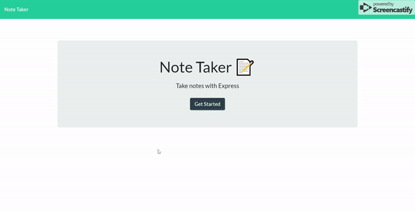

# Note Taker

An app that lets you write, save, and delete notes. The user creates notes by writing a title, the note content, and clicking the save button. An unlimitted amount of notes can be created, and accessed from the note list on the left side of the page. Each note can be deleted by pressing its respective delete button on the list.

### Technologies Used

* [express](https://www.npmjs.com/package/express)
* [node.js](https://nodejs.org/en/)
* [HTML](https://developer.mozilla.org/en-US/docs/Web/HTML)
* [CSS](https://developer.mozilla.org/en-US/docs/Web/CSS)
* [Javascript](https://developer.mozilla.org/en-US/docs/Web/JavaScript)
* [jQuery](https://jquery.com/)
* [Bootstrap](https://getbootstrap.com/)
* [Git](https://git-scm.com/)
* [GitHub](https://github.com/)
* [VSCode](https://code.visualstudio.com/)

## Deployed Link

* https://rocky-river-28623.herokuapp.com/

## Code Snipet

```
  for (var i = 0; i < notes.length; i++) {
    var note = notes[i];

    var $li = $(`<li class='list-group-item' id=${i}>`).data(note);
    var $span = $("<span>").text(note.title);
    var $delBtn = $(
      "<i class='fas fa-trash-alt float-right text-danger delete-note' onClick='window.location.reload()'>"
    );

```
The note list is dynamically generated by this for loop. It also creates a unique identifier for each note on the list.

```
var deleteNote = function(id) {
  return $.ajax({
    url: "api/notes/" + id,
    method: "DELETE"
  });
};

var handleNoteDelete = function(event) {
  event.stopPropagation();

  var note = $(this)
    .parent(".list-group-item")
    .data();

  if (activeNote.id === note.id) {
    activeNote = {};
  }

  deleteNote(note.id).then(function() {
    getAndRenderNotes();
    renderActiveNote();
  });
};
```
The identifier is necessary for the method used to delete the note. On clicking the delete button, the id of the note is read and passed to an ajax call that uses the id to make a delete request to the server.

```
app.delete("/api/notes/:id", function(req, res){
    fs.readFile(path.join(__dirname, "/db/db.json"), "utf-8", function(err, data){
       if (err) throw err;
       
       let db = JSON.parse(data);

       for (var i = 0; i < db.length; i++){
            if(db[i].id === parseInt(req.params.id)){
                db.splice(i,1);
            }
       }

        fs.writeFile(path.join(__dirname, "/db/db.json"), JSON.stringify(db), function(err){
            if (err) throw err;
            console.log("Deleted note successfully!");
        });
    });
});
```
The notes are stored as objects within an array in a JSON file. Upon, receiving a delete request the server reads that JSON file, parses the information, then iterates through the array and deletes the element matching the id that was sent.

## Deployed Demo



## Author

**Yalí Miranda** 

* [Github](https://github.com/yjmiranda)
* [LinkedIn](https://www.linkedin.com/in/yal%C3%AD-miranda-8b4b94199/)